# cv课程设计

**张扬2020212185**

**孙泽凯2020212180**

**目录**

[TOC]

## 一、系统功能描述

我们选择的是实验六：**实时目标跟踪系统**

- **目标跟踪**则是在视频中**连续跟踪**一个或多个目标对象的过程。它通常在目标检测的基础上进行，即首先在视频的初始帧中检测目标，然后在后续帧中跟踪这些目标的位置和状态。
- 目标跟踪需要处理一些额外的挑战，例如目标的移动，遮挡，姿态变化，照明变化，以及相机的移动等。目标跟踪的结果是**视频中每一帧的目标位置**(通常是**一个边界框**)和可能的状态信息。
- 我们的实验六与实验五的区别是：目标检测关注于“在图像中哪里有什么”，而目标跟踪关注于“**目标如何随时间移动**”。

总的来说我们的算法应该实现的目标：

**以摄像头数据或视频数据为输入，前期使用鼠标框选一个物体，开始追踪后追踪框不断追踪该物体的位置**

### 1.1 算法调研

目标跟踪是一个复杂的问题，历史上已经提出了许多方法来解决这个问题。我们调研了以下这些经典的目标跟踪算法：

1. **MeanShift/CAMShift(Continuously Adaptive Mean Shift)**：这些算法基于颜色直方图模型进行目标跟踪。MeanShift算法通过找寻给定窗口中的颜色直方图的最大密度位置来确定目标位置。CAMShift算法是MeanShift的扩展，它能适应目标大小的变化和旋转。

2. **Optical Flow**：光流是一种描述图像帧之间像素或特征点运动的模型。它可以被用于估计目标的位置和速度。其中一种经典的光流方法是Lucas-Kanade方法。

3. **Kalman Filter/Extended Kalman Filter**：卡尔曼滤波器是一种预测系统状态的方法，可以用于预测目标的位置和速度。对于非线性系统，可以使用扩展卡尔曼滤波器。

4. **Particle Filter**：粒子滤波器是一种基于蒙特卡洛方法的非线性和非高斯滤波方法。它使用一组粒子来表示目标的可能状态，并通过重采样来适应目标的运动。

5. **Tracking-Learning-Detection (TLD)**：TLD是一种复杂的长期跟踪方法，它结合了跟踪，学习和检测三个组件来处理目标的外观变化和临时的遮挡。

6. **Correlation Filters, including Kernelized Correlation Filters (KCF)**：相关滤波器是一种基于模板匹配的方法，它可以快速地在图像中寻找与模板相似的区域。KCF是相关滤波器的一个变种，它使用核技巧来处理非线性问题。

7. **Deep Learning based methods**：近年来，深度学习在目标跟踪中也取得了显著的成果。例如，Siamese networks(如SiamFC和SiamRPN)使用深度神经网络来学习目标的外观模型，以实现高效的实时跟踪。

实验指导上的主要参考文献为`《High—Speed Tracking with Kernelized Correlation Filters》`这是第六点中的KCF算法，KCF是相关滤波器的一个变种。

我们打算使用`numpy`库手动实现**KCF算法**，结合`opencv`库处理图像，实现目标跟踪的任务。

## 二、系统设计

KCF算法的基本思想是在**原始的最小输出和滤波器** (Minimum Output Sum of Squared Error, MOSSE) 的基础上引入**核技巧** (Kernel Trick) 进行改进，使得算法能够学习复杂的非线性关系，从而提高了追踪精度。

### 2.1 系统框图

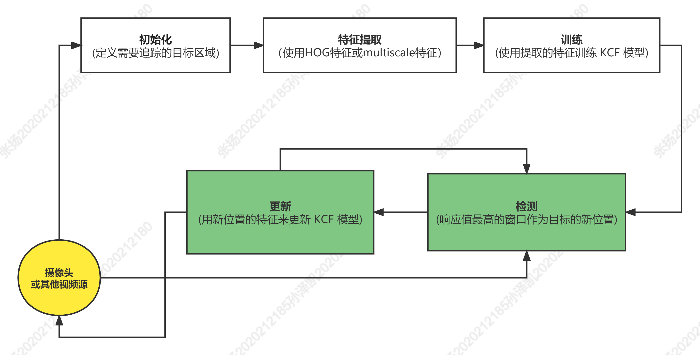

### 2.2 简要提纲

1. **初始化**：在视频序列的第一帧中，定义需要追踪的目标区域。然后，从这个区域中提取特征(使用 HOG 特征或multiscale特征)。

2. **训练**：使用提取的特征训练 KCF 模型。在这个过程中，KCF 将使用圆形窗函数 (circular window function) 计算两个特征之间的自相关 (autocorrelation)。然后，将得到的相关矩阵用于训练滤波器。

3. **检测**：在视频的下一帧中，使用训练好的 KCF 模型对整个图像进行滑窗搜索，计算每个窗口位置的响应值。这个响应值可以理解为目标出现在这个窗口位置的概率。然后，选择响应值最高的窗口作为目标的新位置。

4. **更新**：用新位置的特征来更新 KCF 模型。更新时，通常会使用一个学习率参数来平衡新旧数据的重要性。

5. **循环**：重复步骤 3 和步骤 4，直到视频序列结束。

## 三、核心算法设计

> (理解消化后的自行撰写的算法原理，请勿直接从网上抄或论文直译)

KCF算法的基本思想是通过**计算输入图像和参考图像之间的相关性**，来确定目标物体在图像中的位置。

KCF算法的主要滤波器是使用循环矩阵表示的相关滤波器。相关滤波器在信号处理中有广泛应用，它可以用于检测信号中是否包含某个特定的模式。在KCF中，相关滤波器的使用在于寻找图像中和目标模式相似的区域。

此外，KCF算法还引入了核技巧(`Kernel trick`)。这是一种常见的方法，可以将数据映射到一个更高维的空间，以便更好地处理非线性问题。核技巧在许多机器学习算法中都有使用，如支持向量机(SVM)。

总的来说，KCF算法主要使用了相关滤波器和核技巧这两种技术，前者用于寻找和目标模式相似的区域，后者用于处理非线性问题。

### 3.1 HOG特征

HOG(Histogram of Oriented Gradients)是一种特征描述符，用于对象检测。HOG特征通过统计图像局部区域的梯度方向或边缘方向来构建特征。

HOG特征描述符的计算步骤如下：

1. **归一化图像**：为了减少光照变化对结果的影响，首先将图像归一化。

2. **计算梯度**：在归一化的图像上，用两个方向滤波器分别计算水平和垂直方向的梯度。这两个方向的梯度可以用来得到梯度的幅值和方向。

3. **计算方向直方图**：将图像划分为小的连通区域(通常称为cell)，对每个cell计算梯度的方向直方图。直方图的每个bin代表了一定范围内的梯度方向，bin的值是该方向范围内的所有梯度幅值的和。

4. **归一化直方图**：将每个cell的直方图与其邻近cell的直方图合并，形成更大区域(称为block)。在每个block上对直方图进行归一化，这样可以进一步减小光照变化的影响。

5. **生成特征向量**：将所有block的归一化直方图串联起来，形成最终的HOG特征描述符。

HOG特征的数学描述可以表示为：

对于每个cell，计算梯度的方向直方图：

$$
H(\theta) = \sum_{i=0}^{N-1} m(i) \cdot \delta(\theta - \theta(i))
$$

其中，$m(i)$是像素i的梯度幅值，$\theta(i)$是像素i的梯度方向，$\delta$是Dirac delta函数，表示只有当$\theta = \theta(i)$时才计算$m(i)$。

对于每个block，对直方图进行归一化：

$$H_n = \frac{H}{\sqrt{\|H\|^2_2 + \epsilon^2}}$$

其中，$H_n$是归一化后的直方图，$\|H\|_2$是$H$的L2范数，$\epsilon$是一个很小的常数，用来防止除以零。

最后，所有block的归一化直方图串联起来形成HOG特征描述符。

值得注意的是，HOG特征描述符只考虑了图像的形状信息(通过梯度或边缘)，而忽略了颜色信息。

### 3.2 高斯滤波器和高斯响应图

高斯响应图(Gaussian Response Map)是通过高斯滤波器对图像进行卷积处理得到的结果。在视觉追踪，图像分割，特征检测等领域有广泛应用。

高斯滤波器是一个二维的高斯分布函数，它对图像进行卷积运算，对图像进行平滑处理，可以有效地消除图像的高频噪声。高斯响应图则是描述经过高斯滤波器卷积后，每个像素点的响应强度。

假设原始图像是$I(x, y)$，高斯滤波器(也称高斯核)定义如下：

$$
G(x, y, \sigma) = \frac{1}{2\pi\sigma^2} e^{-\frac{x^2 + y^2}{2\sigma^2}}
$$

其中，$(x, y)$是像素的坐标，$\sigma$是高斯滤波器的标准差，控制了高斯核的大小。

那么，经过高斯滤波后的图像$I'(x, y)$可以表示为：

$$
I'(x, y) = I(x, y) * G(x, y, \sigma)
$$

这里的$*$表示卷积操作。

高斯响应图就是$I'(x, y)$，它给出了图像中每个像素点经过高斯滤波后的强度值。一般来说，高斯响应图中的值会更平滑，边缘和细节部分的强度会降低，因此它常常被用来消除图像的噪声和做预处理。

### 3.3 PCA处理

PCA(Principal Component Analysis)，即主成分分析，是一种常用的数据分析方法，用于数据的降维。PCA的主要思想是通过线性变换，将原始数据变换为一组各维度线性无关的表示，可以用于提取数据的主要特征分量，常用于高维数据的可视化。

PCA的处理步骤如下：

1. **标准化原始数据**：将原始数据每一维度都转化为均值为0，方差为1的数据。这个步骤并不是必须的，但是可以使得PCA对各个维度的数据尺度不敏感。

2. **计算协方差矩阵**：协方差矩阵可以度量各维度变量之间的总体误差。

3. **求解协方差矩阵的特征值和特征向量**：特征值和特征向量是PCA的核心，他们可以揭示数据的主要特征和分布。

4. **将特征向量按对应特征值大小从上到下按行排列成矩阵，取前k行组成矩阵P**。

5. **Y=PX即为降维到k维后的数据**。

PCA的数学描述：

假设我们有一个由n个样本组成的数据集X，每个样本有m个属性，则X是一个n×m的矩阵。我们可以计算X的协方差矩阵C：

$$
C = \frac{1}{n}X^TX
$$

然后我们对C进行特征分解，得到特征值λ和特征向量v：

$$
Cv = λv
$$

排序特征值，选择前k个最大的特征值对应的特征向量v组成一个转换矩阵P，然后用P对X进行线性变换，就可以得到降维后的数据Y：

$$
Y = XP
$$

其中，P是一个m×k的矩阵，Y是n×k的矩阵，每行是一个降维后的样本，保留了原始数据的大部分信息。

### 3.4 使用岭回归方法训练跟踪器的大致流程

KCF (Kernelized Correlation Filter) 是一种用于目标跟踪的算法。KCF 利用了岭回归方法来训练其跟踪器。在深入了解其方法之前，首先需要理解基础的岭回归和相关滤波器(Correlation Filter)。

岭回归是一种用于回归分析的技术，它通过对系数的大小施加惩罚，以解决多重共线性问题。基本的岭回归可以表示为：

$$
\beta = (X^TX + \lambda I)^{-1}X^Ty
$$

其中，$X$ 是输入数据，$y$ 是目标输出，$\beta$ 是待求的回归系数，$I$ 是单位矩阵，$\lambda$ 是控制正则化强度的参数。

在 KCF 中，我们实际上是在训练一个相关滤波器，其目标是找到一个滤波器 $f$, 它能够将一个图像 $x$ 映射到一个目标响应 $y$。在频域中，此目标可以表示为求解以下最小化问题：

$$
\min_f ||\mathcal{F}(f) \odot X - Y||^2 + \lambda||f||^2 
$$

其中，$X$ 和 $Y$ 分别是输入图像和目标响应的傅里叶变换，$\odot$ 表示 Hadamard 乘积(对应元素的乘积)，$||\cdot||^2$ 表示平方范数，$\lambda$ 是正则化参数，$\mathcal{F}(f)$ 是滤波器的傅里叶变换。对于这个问题，我们可以直接得到解析解：

$$
\mathcal{F}(f) = \frac{Y}{X + \lambda} 
$$

然后，我们可以将 $\mathcal{F}(f)$ 通过逆傅里叶变换得到滤波器 $f$。

接下来，我们使用核方法来引入非线性。核方法通过引入一个核函数 $k$，将输入数据映射到高维空间。这允许我们在高维空间中学习非线性模型，同时只需要计算原始输入数据的核函数。对于 KCF，我们使用高斯核函数：

$$
k(x, z) = e^{-\frac{||x-z||^2}{2\sigma^2}} 
$$

其中，$x$ 和 $z$ 是两个输入数据，$\sigma$ 是高斯核的宽度参数。利用核方法，我们可以将 KCF 的优化问题重写为：

$$
\min_\alpha ||\mathcal{F}(k(x, x) \alpha) \odot X - Y||^2 + \lambda \alpha^TK\alpha 
$$

其中，$K = k(x, x)$ 是输入数据的核矩阵，$\alpha$ 是要学习的参数。对于这个问题，

我们可以得到解析解：

$$
\mathcal{F}(\alpha) = \frac{Y}{K \odot X + \lambda} 
$$

然后，我们可以通过逆傅里叶变换得到 $\alpha$，这就是 KCF 的训练过程。在跟踪过程中，我们可以通过将当前图像 $z$ 映射到训练过的滤波器 $\alpha$，来预测目标的位置：

$$
y = k(z, x) \alpha 
$$

以上就是 KCF 使用岭回归方法训练跟踪器的大致流程。

### 3.5 核技巧

核技巧(Kernel trick)是在机器学习中常用的一种技术，它使我们可以在高维空间中进行计算，而无需显式地进行高维空间的计算。核技巧通常用于处理非线性问题，它的主要思想是将数据映射到一个高维空间，使得在高维空间中数据变得线性可分，然后在高维空间中进行线性学习。

这里的"核"(Kernel)指的是一个函数，它可以计算在高维空间中两个数据点的内积，而不需要显式地将数据点映射到高维空间。这个函数可以是任何满足 Mercer 定理的函数，常见的核函数包括线性核、多项式核、径向基函数(Radial Basis Function，RBF)核等。

例如，我的理解是：

在原始二维空间中，两个向量 $(x_1, x_2)$ 和 $(y_1, y_2)$ 的内积定义为：

$$
\begin{aligned}
(x_1, x_2) \cdot (y_1, y_2) = x_1y_1 + x_2y_2
\end{aligned}
$$

如果我们将二维向量映射到一个三维空间，即

$$
(x_1, x_2) \rightarrow (x_1^2, \sqrt{2}x_1x_2, x_2^2)
$$
$$
(y_1, y_2) \rightarrow (y_1^2, \sqrt{2}y_1y_2, y_2^2)
$$

那么在这个三维空间中，这两个向量的内积变为：

$$
\begin{aligned}
(x_1^2, \sqrt{2}x_1x_2, x_2^2) \cdot (y_1^2, \sqrt{2}y_1y_2, y_2^2) &= x_1^2y_1^2 + 2x_1x_2y_1y_2 + x_2^2y_2^2 \\
&= (x_1y_1 + x_2y_2)^2 \\
&= (x \cdot y)^2
\end{aligned}
$$

我们可以看到，尽管在高维空间中计算内积可能非常复杂，但如果我们使用适当的核函数(在这个例子中，是$(x \cdot y)^2$)，我们可以直接在原始空间中进行计算，无需显式地进行高维映射。这就是核技巧的基本思想。

## 四、系统实现

(算法实现、界面实现)

### 4.1 前端界面和获取数据(`App.py`)

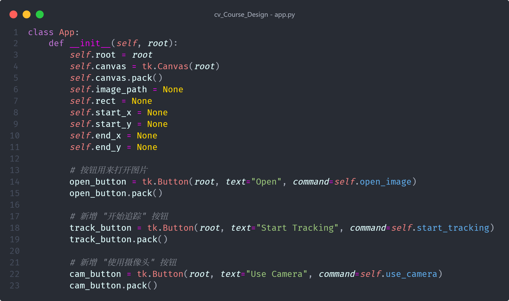

定义`app`类，共有三个按钮，分别是打开图片、开始追踪、使用摄像头
具体结构如下：

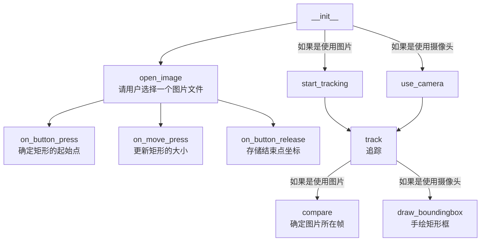
```mermaid
graph TD
  A[__init__] --> B[open_image\n请用户选择一个图片文件]
  A -->|如果是使用图片| C[start_tracking]
  A -->|如果是使用摄像头| D[use_camera]
  B --> E[on_button_press\n确定矩形的起始点]
  B --> F[on_move_press\n更新矩形的大小]
  B --> G[on_button_release\n存储结束点坐标]
  C --> H[track\n追踪]
  D --> H
  H -->|如果是使用图片| I[compare\n确定图片所在帧]
  H -->|如果是使用摄像头| J[draw_boundingbox\n手绘矩形框]
```
#### 4.1.1A 使用图片

##### (1) 打开图片(`open_image`)

```py
def open_image(self):
```
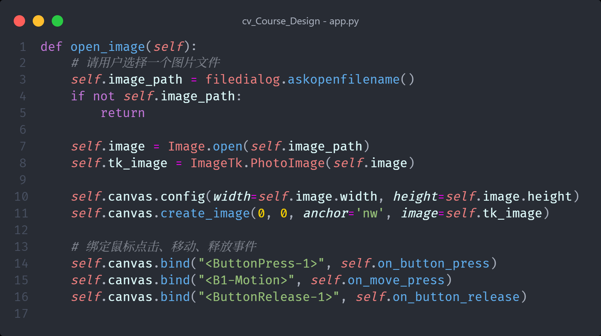

`open_image` 方法，是在 `App` 类中定义的。

该方法的作用是让用户打开一个图片文件，并在应用程序的 `canvas`(画布)上显示该图片。同时，该方法也会为鼠标事件绑定相关的方法。

以下是该方法中各行代码的详细说明：

1. `self.image_path = filedialog.askopenfilename()`：调用 `filedialog.askopenfilename()` 函数打开一个文件选择对话框，让用户选择一个图片文件。选定的文件的路径被保存在 `self.image_path` 中。

2. `if not self.image_path: return`：如果用户没有选择任何文件(即 `self.image_path` 为 `None` 或者空字符串)，则该方法立即返回并不执行后续的代码。

3. `self.image = Image.open(self.image_path)`：使用 PIL(Python Imaging Library，Python的图像处理库)的 `Image.open` 方法打开用户选择的图片文件，然后将结果保存在 `self.image` 中。

4. `self.tk_image = ImageTk.PhotoImage(self.image)`：将打开的图片转化为一个 Tkinter 可以在 `canvas` 上显示的对象，并将结果保存在 `self.tk_image` 中。

5. `self.canvas.config(width=self.image.width, height=self.image.height)`：将 `canvas` 的宽度和高度设置为图片的宽度和高度。

6. `self.canvas.create_image(0, 0, anchor='nw', image=self.tk_image)`：在 `canvas` 的左上角('nw' 代表 northwest，即西北方向，也就是左上角)位置放置图片。

7. `self.canvas.bind("<ButtonPress-1>", self.on_button_press)`：将 `canvas` 的鼠标左键按下事件(`<ButtonPress-1>`)绑定到 `on_button_press` 方法。**用于确定矩形的起始点**。

8. `self.canvas.bind("<B1-Motion>", self.on_move_press)`：将 `canvas` 的鼠标左键移动事件(即按下鼠标左键并移动，`<B1-Motion>`)绑定到 `on_move_press` 方法。**用于更新矩形的大小**。

9. `self.canvas.bind("<ButtonRelease-1>", self.on_button_release)`：将 `canvas` 的鼠标左键释放事件(`<ButtonRelease-1>`)绑定到 `on_button_release` 方法。用于**存储结束点坐标**。

##### (2) 开始追踪(`start_tracking`)

```py
def start_tracking(self):
```
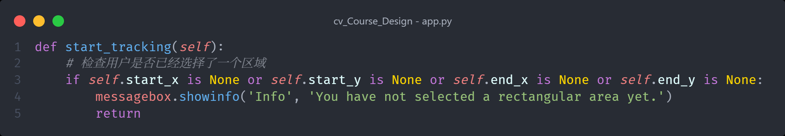

`start_tracking`方法的作用是验证用户是否已经选择了图片，如果没有选择图片则弹出一个警告对话框，否则调用`track`方法开始追踪。

##### (3) 确定图片所在帧的位置(`compare`)

```py   
def compare(self):
```
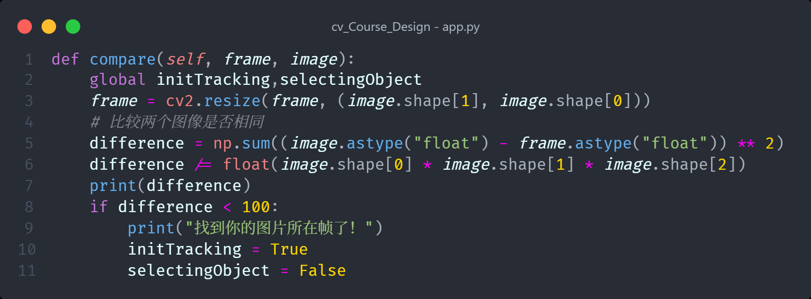

`compare` 方法用于比较两个图像(`frame` 和 `image`)是否相同。从而找到图片所在帧，并从那里开始追踪。

1. 首先声明 `initTracking` 和 `selectingObject` 为全局变量，使得这个函数内部可以修改这两个变量的值。**这是用于操控`track`逻辑的两个变量**。

2. 然后使用 OpenCV 的 `resize` 函数，将 `frame` 图像的大小调整为与 `image` 图像相同。

3. 之后计算 `difference`：先将两个图像转换为浮点数，然后计算差值的平方，接着将所有像素点的差值求和，最后将和除以图像的尺寸(长×宽×色彩通道数)，这样得到的 `difference` 是两个图像的平均差值。

4. 如果 `difference` 小于100，打印出 "找到你的图片所在帧了！"，并设置 `initTracking` 为 `True`，`selectingObject` 为 `False`。**以便开始追踪。**


####  4.1.1B 通过摄像头获取视频流

##### (1) 打开摄像头(`use_camera`)

```py
    def use_camera(self):
        # 使用摄像头，传入空的视频路径和零坐标
        self.track('', (0, 0, 0, 0), '')
```

如果用户选择了摄像头，则调用 `track` 方法，传入传入空的视频路径和零坐标，`track` 方法会自动进入摄像头模式开始追踪。

##### (2) 绘制边界框(`draw_boundingbox`)

```py
def draw_boundingbox(event, x, y, flags, param):
```

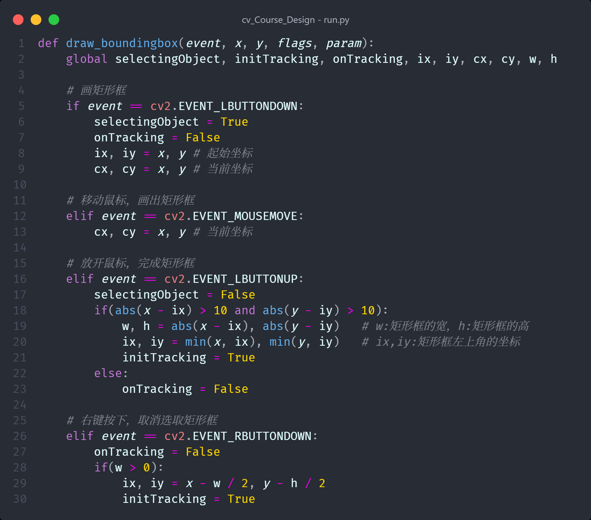

`draw_boundingbox()`是定义需要追踪的目标区域的函数

用户可以用鼠标在图片上绘制一个矩形框(即“边界框”或 "bounding box")。这个函数是处理鼠标事件的回调函数，它会被OpenCV的`cv2.setMouseCallback()`函数使用。

这个函数中定义了一些全局变量：

- `selectingObject`：布尔值，如果当前正在选择对象则为True。
- `initTracking`：布尔值，如果需要初始化追踪则为True。
- `onTracking`：布尔值，如果当前正在追踪对象则为True。
- `ix, iy`：起始点(鼠标左键按下的位置)的x和y坐标。
- `cx, cy`：当前鼠标位置的x和y坐标。
- `w, h`：矩形框的宽度和高度。

函数处理了四种鼠标事件：

1. `cv2.EVENT_LBUTTONDOWN`：左键按下时，开始选择对象，记录下当前鼠标的位置作为矩形框的起始点。

2. `cv2.EVENT_MOUSEMOVE`：鼠标移动时，记录下当前鼠标的位置。

3. `cv2.EVENT_LBUTTONUP`：左键释放时，完成选择对象。如果鼠标移动距离足够大(大于10像素)，那么将计算出矩形框的宽度和高度，同时设定矩形框的起始点为左上角(x和y坐标较小的点)。此时需要初始化追踪。

4. `cv2.EVENT_RBUTTONDOWN`：右键按下时，取消选择对象。如果已经有一个矩形框存在，那么将矩形框的中心设定为当前鼠标的位置，并需要初始化追踪。

这样，在图像中就可以通过鼠标操作来选择和追踪感兴趣的区域。


#### 4.1.2 开始追踪(`track`)

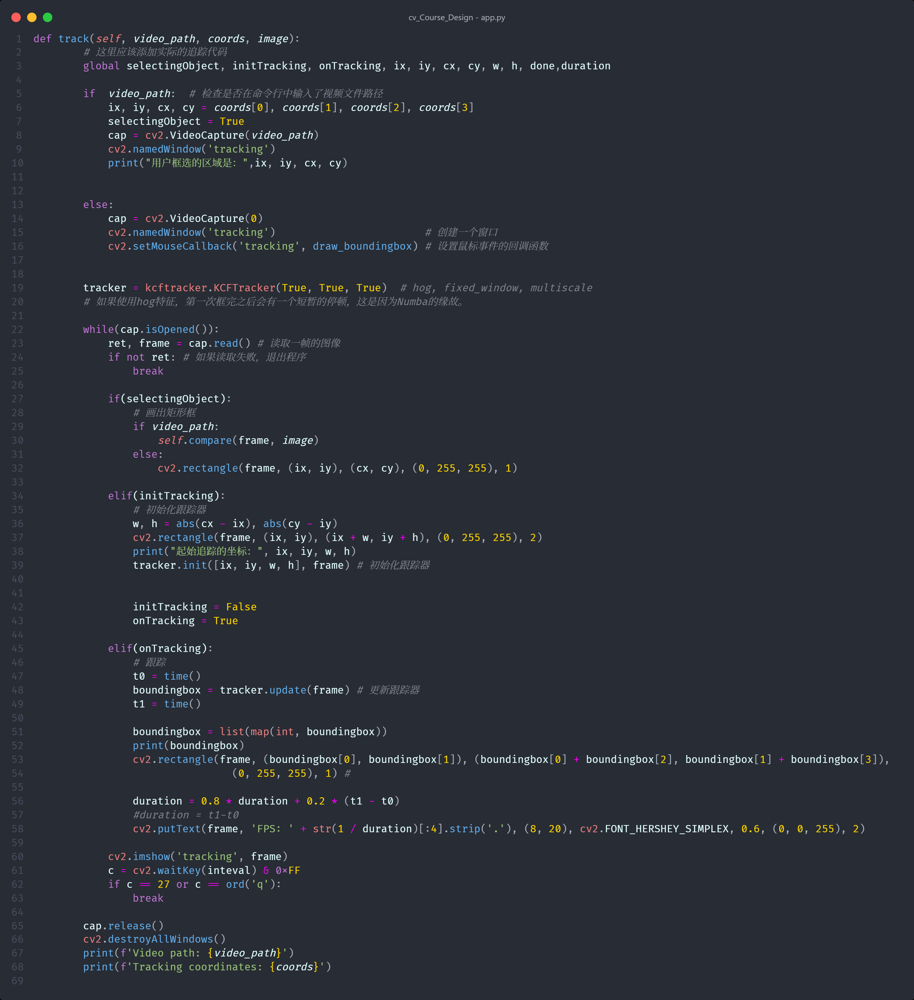

##### (1) 主逻辑

`track` 函数以视频路径、坐标和图像作为输入参数。以下是此函数的核心逻辑：

1. 根据是否提供了视频路径 (`video_path`)，函数确定是打开视频文件还是打开摄像头进行实时追踪。

2. 如果有视频路径，就将视频文件载入 `cv2.VideoCapture` 对象，然后提取用户选择的坐标(`coords`)并设置 `selectingObject` 为 `True`。

3. 如果没有视频路径，就打开摄像头(通过 `cv2.VideoCapture(0)`)，并注册一个鼠标回调函数以供用户选择要追踪的对象。

4. 初始化一个 KCF (Kernelized Correlation Filters) 追踪器。这是一个常用的目标追踪算法。

5. 进入主循环，不断读取视频帧并进行处理：

    a. 如果正在选择对象 (`selectingObject`)，就在当前帧上绘制出选择的区域，并且如果有视频路径，就调用 `compare` 函数比较当前帧与用户选择的图像。

    b. 如果已经初始化了追踪 (`initTracking`)，就在当前帧上初始化 KCF 追踪器，并设置 `onTracking` 为 `True`，表示开始追踪。

    c. 如果正在进行追踪 (`onTracking`)，就调用 KCF 追踪器的 `update` 方法更新追踪器，然后在当前帧上绘制追踪框，并计算并显示 FPS (Frames Per Second，每秒帧数)。

6. 通过按键可以退出循环，并在退出循环后关闭视频文件或摄像头，并销毁所有创建的窗口。

7. 最后，打印出视频路径和追踪坐标信息。

##### (2) 使用`KCFTracker`

在这个 `track` 方法中，`KCFTracker` 是使用 Kernelized Correlation Filters(基于相关滤波器的核方法)的目标追踪算法进行对象追踪的工具。在追踪开始前，`KCFTracker` 对象会被初始化，并在视频流的处理过程中用于更新追踪目标的位置。

以下是 `KCFTracker` 在这个函数中的详细使用过程：

1. 在开始追踪之前，首先创建了一个 `KCFTracker` 对象，代码中的 `True, True, True` 参数对应的是 HOG 特征、固定窗口和多尺度选项。这些参数会影响追踪器的性能和准确性。

2. 当用户选定追踪目标后(即 `initTracking` 为 `True`)，`tracker.init([ix, iy, w, h], frame)` 方法被调用。`[ix, iy, w, h]` 是目标的初始边界框坐标，`frame` 是包含目标的图像帧。此步骤是在第一帧图像上对追踪目标进行初始化。

3. 在视频流处理的每一帧上，如果 `onTracking` 为 `True`，则调用 `tracker.update(frame)` 方法。这个方法会根据新的帧更新追踪目标的位置，并返回新的边界框坐标。

4. 返回的边界框坐标被用于在当前帧上绘制边界框，这样就能可视化地展示出当前追踪目标的位置。

即总逻辑为：

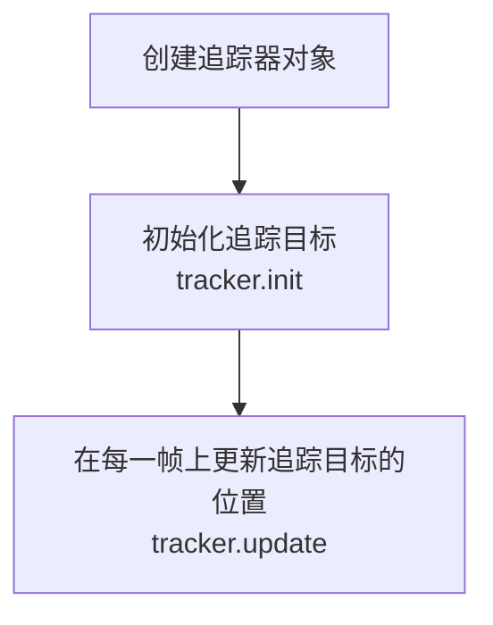
```mermaid
graph TD
  A[创建追踪器对象] --> B[初始化追踪目标\ntracker.init]
  B --> C[在每一帧上更新追踪目标的位置\ntracker.update]
```

### 4.2 KCF追踪器(`kcftracker.py`)

#### 4.2.0 总逻辑

KCF 追踪器的实现代码在 `kcftracker.py` 文件中。这个文件中定义了一个 `KCFTracker` 类，用于实现 KCF 追踪器的功能。

下面是该类的结构

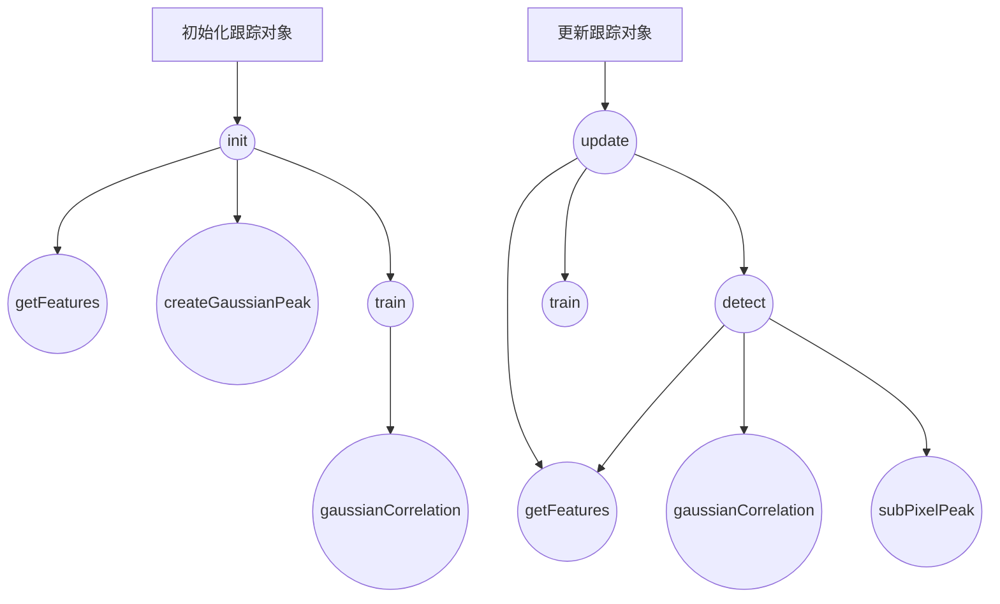
```mermaid
graph TD
    初始化跟踪对象 --> init((init))
    更新跟踪对象 --> update((update))
    init((init)) --> getFeatures1((getFeatures))
    init((init)) --> createGaussianPeak1((createGaussianPeak))
    init((init)) --> train1((train))
    train1((train)) --> gaussianCorrelation1((gaussianCorrelation))
    update((update)) --> getFeatures((getFeatures))
    update((update)) --> detect((detect))
    detect((detect)) --> getFeatures((getFeatures))
    detect((detect)) --> gaussianCorrelation((gaussianCorrelation))
    detect((detect)) --> subPixelPeak((subPixelPeak))
    update((update)) --> train((train))
```

#### 4.2.1 `__init__` 构造函数

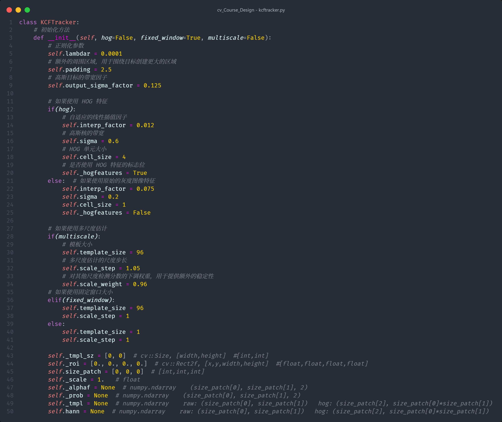

以下是对KCFTracker类初始化方法中各个参数的解释：

1. `hog`: 是否使用直方图方向梯度(Histogram of Oriented Gradients, HOG)特征进行目标跟踪。HOG特征能够捕捉图像的局部结构信息，这对于许多计算机视觉任务非常有用。

2. `fixed_window`: 是否固定窗口大小。如果设置为True，那么跟踪窗口的大小在整个目标跟踪过程中将保持不变。

3. `multiscale`: 是否使用**多尺度估计**。多尺度估计可以帮助跟踪器更好地处理目标大小变化的情况。

4. `self.lambdar`: 正则化参数，用于**避免过拟合**。

5. `self.padding`: 额外的周围区域，用于围绕目标创建更大的区域，这可以帮助提高跟踪的稳定性。

6. `self.output_sigma_factor`: **高斯目标的带宽因子**，用于设置高斯响应图的峰值宽度。这个参数会影响到滤波器的训练和目标定位。

7. `self.interp_factor`: 自适应的**线性插值因子**，用于在模型更新时对新的滤波器和原滤波器进行混合。

8. `self.sigma`: **高斯核的带宽**，用于控制目标周围的背景权重。

9. `self.cell_size`: **HOG特征的单元格大小**，或者原始灰度图像特征的大小。

10. `self.template_size`: **模板的大小**，它定义了用于目标跟踪的区域大小。

11. `self.scale_step`: **多尺度估计的尺度步长**，用于确定每次尺度变化的大小。

12. `self.scale_weight`: 对其他尺度检测分数的下调权重，用于提供额外的稳定性。如果检测到的目标在不同尺度下的分数差异较大，那么这个参数可以帮助选择更稳定的尺度。

#### 4.2.2 初始化跟踪器(`init`)

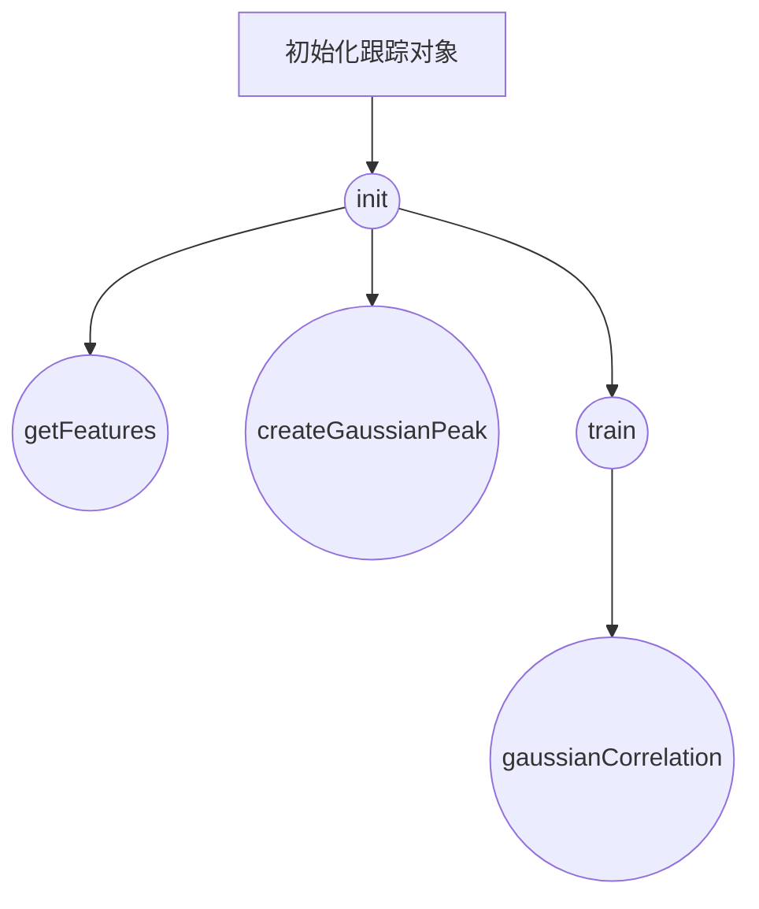
```mermaid
graph TD
    初始化跟踪对象 --> init((init))
    init((init)) --> getFeatures1((getFeatures))
    init((init)) --> createGaussianPeak1((createGaussianPeak))
    init((init)) --> train1((train))
    train1((train)) --> gaussianCorrelation1((gaussianCorrelation))
```

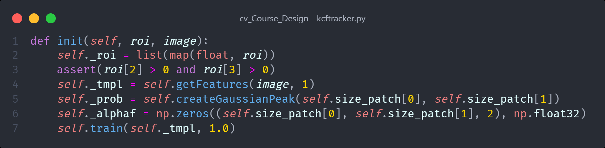

这个`init`方法在KCFTracker类中的作用是进行初始化，为开始视频跟踪做准备。下面是其执行步骤的详细条理化说明：

1. **设置初始目标位置**：利用`self._roi = list(map(float, roi))`将输入的roi(目标的初始位置)转换为浮点数并保存。roi是一个包含四个元素的列表，表示目标在图像中的x坐标，y坐标，宽度和高度。

2. **检查ROI的有效性**：通过`assert(roi[2] > 0 and roi[3] > 0)`来确保ROI的宽和高都大于0。如果不满足这个条件，程序将抛出错误。

3. **提取特征**：通过`self._tmpl = self.getFeatures(image, 1)`从初始帧中提取特征。这个特征将作为模板(template)保存在`self._tmpl`中，用于后续的滤波器训练。具体的特征提取过程取决于`getFeatures`方法的实现，可能包括原始像素强度，HOG特征等。

4. **创建高斯响应图**：通过`self._prob = self.createGaussianPeak(self.size_patch[0], self.size_patch[1])`来创建一个高斯响应图。这个图将被用作目标的理想响应，即我们期望滤波器在此位置得到最高的响应。具体的生成过程需要在`createGaussianPeak`方法中实现。

5. **初始化滤波器的频域表示**：通过`self._alphaf = np.zeros((self.size_patch[0], self.size_patch[1], 2), np.float32)`来初始化滤波器的频域表示。这里`self._alphaf`被设置为一个全零的数组，预备存储滤波器的频域表示。

6. **训练滤波器**：最后，通过`self.train(self._tmpl, 1.0)`调用`train`方法在初始帧上进行滤波器的训练。这个过程将使用到前面步骤中提取的特征和创建的高斯响应图。

总结来说，`init`方法的主要工作是设定初始的目标位置，提取初始帧的特征，创建理想的响应，然后利用这些信息训练出初始的滤波器。完成这些步骤后，就可以开始在后续的视频帧中进行目标跟踪了。

##### 4.2.2.A 提取特征(`self.getFeatures`)

**在 init 方法中调用 getFeatures 方法并将其返回值赋给 self._tmpl 的目的是为了在目标跟踪开始时从初始帧中提取目标的特征，并将这些特征保存下来作为模板(template)。**

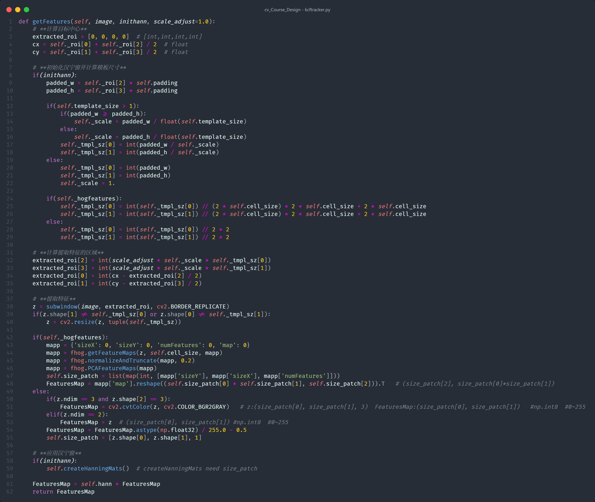

`getFeatures`方法的作用是从给定的图像中提取特征，这些特征将用于目标跟踪。它主要通过以下步骤执行：

1. **计算目标中心**：首先，该方法计算目标区域的中心坐标`cx`和`cy`。

2. **初始化汉宁窗并计算模板尺寸**：如果参数`inithann`为真，方法会创建一个汉宁窗并根据目标区域的大小计算模板的尺寸。模板尺寸的计算需要考虑是否使用了HOG特征和单元格大小等参数。

3. **计算提取特征的区域**：之后，该方法计算出从原图中提取特征的区域`extracted_roi`。

4. **提取特征**：提取`extracted_roi`区域中的特征。**如果使用了HOG特征，会调用`fhog`方法获取特征图，并进行归一化和PCA处理**；如果没有使用HOG特征，则直接从原图像中提取灰度值或者原始像素值，并将其转换为浮点数并进行标准化。

5. **应用汉宁窗**：如果参数`inithann`为真，会创建汉宁窗，并将汉宁窗应用到特征图上。

数学逻辑上，特征提取的区域是通过中心点`(cx, cy)`和模板的宽高来计算的，公式如下：

$$
\begin{align*}
extracted\_roi[0] & = cx - \frac{extracted\_roi[2]}{2} \\
extracted\_roi[1] & = cy - \frac{extracted\_roi[3]}{2} \\
extracted\_roi[2] & = scale\_adjust * self.\_scale * self.\_tmpl\_sz[0] \\
extracted\_roi[3] & = scale\_adjust * self.\_scale * self.\_tmpl\_sz[1] \\
\end{align*}
$$

对于特征图的标准化，使用的公式是：

$$
FeaturesMap = \frac{FeaturesMap}{255.0} - 0.5
$$

对于汉宁窗的应用，使用的公式是：

$$
FeaturesMap = self.hann * FeaturesMap
$$

这里`*`表示元素级别的乘法，`self.hann`是预先计算的汉宁窗。

下面是这些步骤中用到的一些重要概念的解释：

- **ROI**：ROI是"Region of Interest"的缩写，意思是感兴趣的区域，是在图像中需要处理的区域。

- **Hanning窗**：Hanning窗是一种窗函数，用于在做傅立叶变换时减少频谱泄漏。在这里，它被应用于特征图，是为了在计算相关性时减小图像边缘的影响。

- **HOG特征**：HOG是"Histogram of Oriented Gradients"的缩写，意思是方向梯度直方图，是一种常用的图像特征。HOG特征可以很好地捕捉图像的形状信息，对于目标检测和识别任务很有用。

- **PCA**：PCA是"Principal Component Analysis"的缩写，意思是主成分分析，是一种常用的降维方法。通过PCA，可以将高维数据映射到低维空间，同时尽可能保留原始数据的信息。


#####  4.2.2.B 创建高斯响应图(`self.createGaussianPeak`)

在`KCFTracker`类的`init`方法中，`createGaussianPeak`函数被用于生成一个二维的高斯响应图(`self._prob`)，这个响应图的大小是以`size_patch`的第0和第1个元素为参数输入的。

这个高斯响应图(`self._prob`)是理想的响应图，用于表示在目标位置(即响应图的峰值处)找到目标的可能性(或者说概率)是最高的。在之后的跟踪过程中，跟踪器会通过寻找实际的响应图的峰值位置来定位目标，这个峰值位置应该尽可能地接近这个理想的高斯响应图的峰值位置。这样做的目的是为了使得跟踪结果尽可能地接近于理想结果，从而提高跟踪的准确性。

```py 
def createGaussianPeak(self, sizey, sizex):
```
`createGaussianPeak`函数的主要目标是创建一个二维的高斯分布，其中最高点(peak)在中心。

以下是该函数的详细步骤：

1. 首先，计算高斯分布的中心(`syh, sxh`)即是输入矩阵的中心位置。

2. 然后，计算标准差`output_sigma`。标准差是基于输入矩阵的大小，`self.padding`和`self.output_sigma_factor`计算得出。在这里，`self.padding`是额外的周围区域用于围绕目标创建更大的区域，`self.output_sigma_factor`是高斯目标的带宽因子。计算公式如下：

   $$ output\_sigma = \sqrt{sizex * sizey} / self.padding * self.output\_sigma\_factor $$

3. 计算高斯函数的指数部分的乘数`mult`。计算公式如下：

   $$ mult = -0.5 / (output\_sigma * output\_sigma) $$

4. 使用`np.ogrid`生成网格坐标(`y`和`x`)，然后计算每个坐标相对于中心坐标(`syh, sxh`)的距离平方。

5. 使用高斯公式计算高斯分布，公式如下：

   $$ res = exp(mult * (y + x)) $$

6. 最后，对生成的二维高斯分布进行离散傅立叶变换(`fftd`)并返回结果。

通过这个函数生成的高斯分布会被用作理想的响应图，在后续的跟踪过程中，跟踪器会通过寻找最大相关性的位置来定位目标，该位置应该接近这个高斯分布的峰值位置。

##### 4.2.2.C 训练滤波器(`self.train`)

在`init`方法中，`train`方法被调用是为了初始化目标追踪器的模板(`_tmpl`)和滤波器(`_alphaf`)。在这里，用初始帧的目标特征(通过`getFeatures`方法提取得到的`_tmpl`)进行训练。

具体来说，该步骤做了以下两件事：

1. 利用高斯相关性计算目标特征`_tmpl`与其自身之间的相似度，并得到高斯相关矩阵`k`。
2. 通过高斯相关矩阵`k`和理想的响应图`_prob`，使用复数除法计算得到频域滤波器`alphaf`。

然后，我们用线性插值的方式来初始化模板`_tmpl`和滤波器`_alphaf`。在这里，插值因子设置为1.0，意味着我们完全使用了初始帧的信息来初始化模板和滤波器，没有融合其他帧的信息。

这样，一旦初始化完成，我们就可以在后续的追踪过程中，根据新的观测结果持续更新模板和滤波器，以达到更准确地追踪目标的效果。

```py
def train(self, x, train_interp_factor):
```

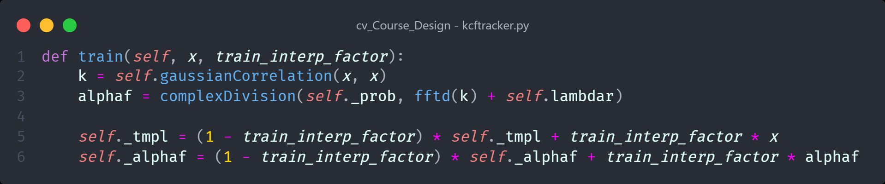

`train`方法的作用是对追踪器进行训练，以便于更好地进行目标追踪。这个方法包含了两个关键的步骤：计算高斯相关性(`gaussianCorrelation`)和更新模板以及相关滤波器(`alphaf`)。

1. **计算高斯相关性**：

这一步计算当前帧特征(`x`)与其自身的高斯相关性。它能够评估不同特征之间的相似度，用于对相同特征的自相似性进行度量。

数学公式如下：

$$
k = gaussianCorrelation(x, x)
$$

2. **更新模板以及相关滤波器(`alphaf`)**：

首先，使用复数除法计算滤波器的频域表示(`alphaf`)，公式为：

$$
alphaf = \frac{prob}{fftd(k) + lambdar}
$$

其中，`prob`是目标的理想响应图，`fftd(k)`是高斯相关性的离散傅里叶变换，`lambdar`是正则化参数。

然后，使用一个线性插值因子(`train_interp_factor`)来更新模板(`_tmpl`)和滤波器(`_alphaf`)。这是一个权衡上一帧信息和当前帧信息的过程，以便于追踪器能够适应目标的可能变化。

数学公式如下：

$$
\_tmpl = (1 - train\_interp\_factor) * \\ \_tmpl + train\_interp\_factor * x
$$


$$
\_alphaf = (1 - train\_interp\_factor) * \\ \_alphaf + train\_interp\_factor * alphaf
$$

其中，`train_interp_factor`是插值因子，用于平衡新旧数据的权重，`_tmpl`和`_alphaf`是在上一帧中计算得到的模板和滤波器，`x`和`alphaf`则是在当前帧计算得到的。通过这种方式，追踪器能够在保留过去信息的同时，逐渐适应目标的变化。

#### 4.2.3 追踪目标(`self.update`)

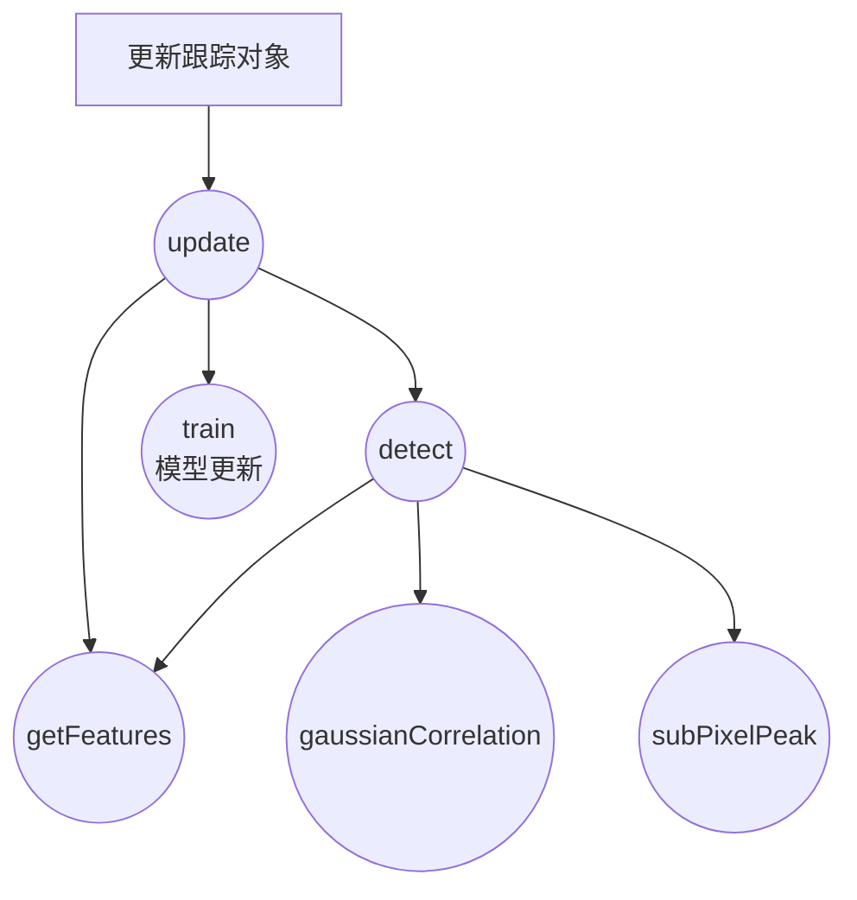
```mermaid
graph TD
    更新跟踪对象 --> update((update))
    update((update)) --> getFeatures((getFeatures))
    update((update)) --> detect((detect\n用之前训练的模型检测目标))
    detect((detect)) --> getFeatures((getFeatures))
    detect((detect)) --> gaussianCorrelation((gaussianCorrelation))
    detect((detect)) --> subPixelPeak((subPixelPeak))
    update((update)) --> train((train\n模型更新))
```
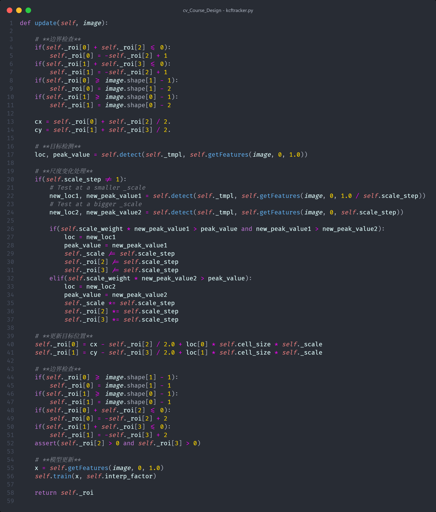

`update`方法主要完成了在新的图像帧中追踪目标的任务。其主要的步骤如下：

1. **边界检查**：首先，它会对当前的ROI(region of interest，即目标区域)进行边界检查，确保ROI的坐标落在图像内部。此步骤主要是为了防止出现越界的情况。

2. **目标检测**：然后，它会**在当前帧中用之前训练的模型检测目标**。这通过调用`detect`方法完成，该方法将当前模板`_tmpl`和从新的图像帧中提取的特征一起输入。`detect`方法的输出是新的目标位置和相应的峰值(表示预测的置信度)。

3. **尺度变化处理**：如果设置了`scale_step`参数(不等于1)，则会对目标在不同尺度下进行检测。这主要是为了应对目标尺度变化的情况。如果在较大或较小的尺度下检测到的目标比原尺度下的更准确，那么就更新目标的位置和尺度。

4. **更新ROI**：然后，它会根据新检测到的目标位置更新ROI。注意，新的位置是相对于ROI中心的偏移量，所以在更新ROI时，需要将这个偏移量转换为绝对坐标。

5. **再次进行边界检查**：再次进行边界检查，确保更新后的ROI仍然落在图像内部。

6. **模型更新**：最后，它会使用**新的图像帧中的目标特征来更新模型**。这是通过调用`train`方法完成的，该方法将新提取的特征和插值因子作为输入。

`update`方法的最后返回更新后的ROI，代表在新的图像帧中检测到的目标位置。

##### 4.2.3.A 目标检测(`self.detect`)

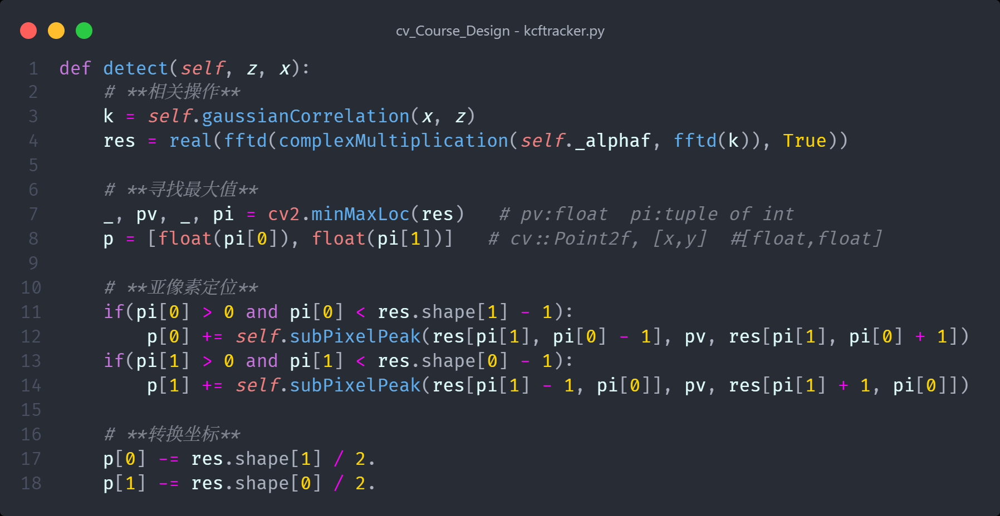

`detect`方法的主要目标是在新的图像帧中找到目标的位置。它实现了一种基于频域的相关操作来找到目标的新位置。这里的主要步骤如下：

1. **相关操作**：它首先计算输入的两个特征向量(这里是`x`和`z`)之间的高斯相关性。然后，利用频域中的乘法-加法性质，通过直接对高斯相关性的傅里叶变换和模型的`_alphaf`进行复数乘法，来实现相关操作。这个操作的结果被存储在`res`中。

2. **寻找最大值**：然后，它找到`res`中的最大值和对应的位置，这代表目标在新的图像帧中的最可能位置。

3. **亚像素定位**：接着，如果最大值不在`res`的边缘，那么就使用亚像素定位来提高目标位置的精度。亚像素定位是通过对最大值位置的邻居值进行插值实现的，这里使用的是`subPixelPeak`方法来完成插值。

4. **转换坐标**：最后，将目标的位置从`res`的坐标系转换为原始图像的坐标系，这主要是通过将目标的坐标减去`res`中心的坐标来实现的。

该方法的输出是目标的新位置(相对于`res`中心的坐标)和对应的最大值，即目标的预测置信度。

在`update`方法中，`detect`函数被调用了三次，每次的调用都是为了在不同的比例(scale)下寻找目标对象。这种多尺度搜索可以使跟踪器适应目标大小的变化。

1. **原始比例下的检测**：第一次调用`detect`是在原始的比例(scale)下进行目标检测。这时检测的输入是特征`x`，这个特征是在原始比例下从当前帧提取的。

2. **较小比例下的检测**：如果允许进行比例调整(即`self.scale_step != 1`)，第二次调用`detect`是在较小的比例下进行目标检测。这时检测的输入是特征`new_loc1`，这个特征是在较小比例下从当前帧提取的。

3. **较大比例下的检测**：同样，如果允许进行比例调整，第三次调用`detect`是在较大的比例下进行目标检测。这时检测的输入是特征`new_loc2`，这个特征是在较大比例下从当前帧提取的。

然后，这三次检测的结果会被比较，选择出最大响应值对应的位置作为新的目标位置，相应的，跟踪框的大小也会根据检测的比例进行调整。这样，跟踪器就可以适应目标大小的变化，从而提高跟踪的精度和鲁棒性。

##### 4.2.3.B 模型更新(`self.train`)

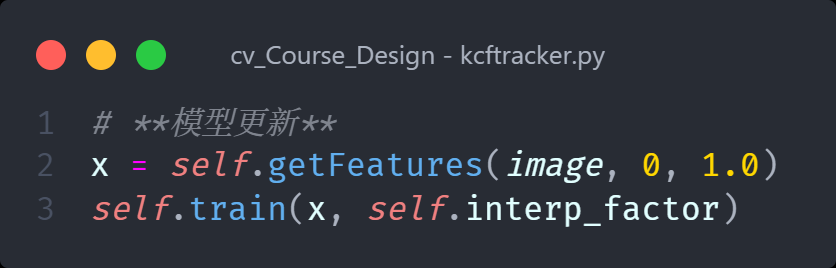

train方法在update方法中被调用的目的是在新的图像帧上更新跟踪器的模型。

首先，通过`self.getFeatures(image, 0, 1.0)`提取出当前帧(`image`)上目标区域的特征`x`。

然后，通过`self.train(x, self.interp_factor)`将这些新提取的特征用于更新跟踪模型。其中，`self.interp_factor`是一个权重因子，控制新提取的特征和原有模型之间的融合程度。

具体来说，`train`方法通过计算新特征`x`自相关的高斯核和目标的先验(在模型初始化时由`createGaussianPeak`创建的高斯峰值)之间的复数除法，来更新频域中的滤波器`_alphaf`。同时，也会对模型的特征模板`_tmpl`进行更新。

这样，跟踪器就可以适应目标的外观变化，进而提高跟踪的精度和鲁棒性。

### 4.3 Numba加速的HOG特征提取(`fhog.py`)

在`getFeatures`会调用`fhog`方法获取特征图，并进行归一化和PCA处理。

```python
mapp = fhog.getFeatureMaps(z, self.cell_size, mapp)
mapp = fhog.normalizeAndTruncate(mapp, 0.2)
mapp = fhog.PCAFeatureMaps(mapp)
```
#### 4.3.1 获取特征图(`fhog.getFeatureMaps`)

Just-In-Time(JIT)是一种编译技术，可以在运行时动态将字节码或源代码转换为机器代码，从而提高程序的运行速度。在Python中，Numba库提供了JIT装饰器(`@jit`)，可以自动优化Python函数的性能。

通过将JIT装饰器添加到这些函数上，可以自动优化这些函数的性能，从而显著提高整个`getFeatureMaps`方法的运行速度。

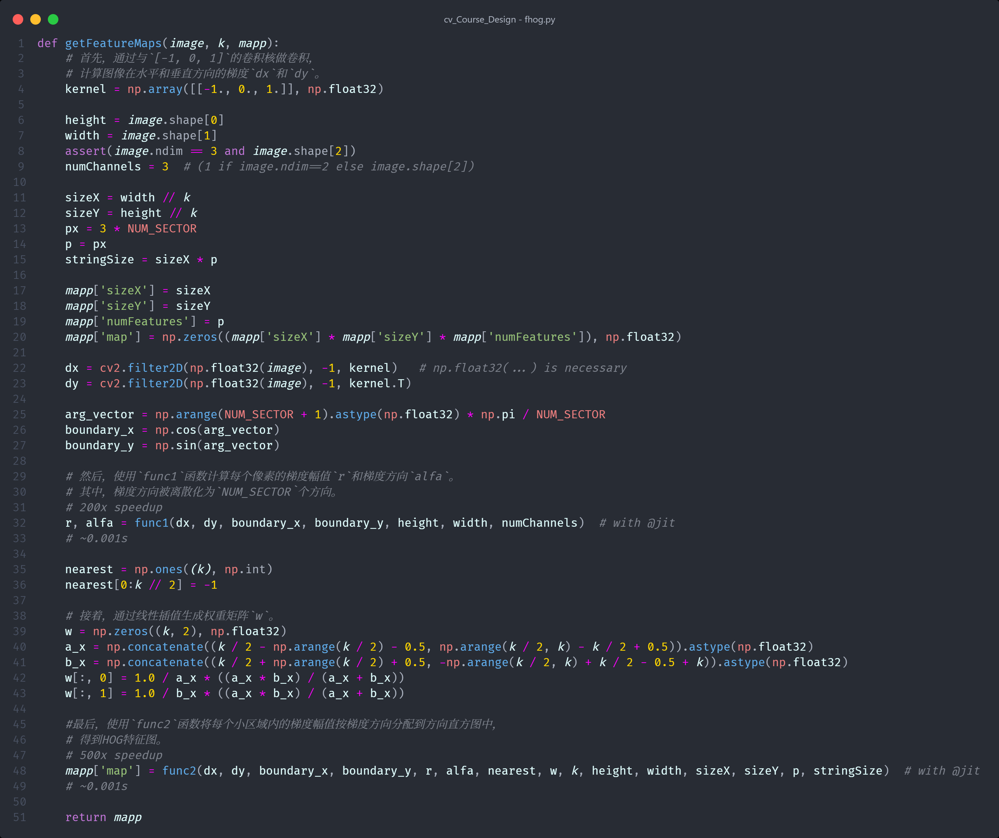

`getFeatureMaps`方法的主要逻辑是计算输入图像的方向梯度直方图(Histogram of Oriented Gradient，简称HOG)特征，HOG特征可以捕捉物体的形状信息，而不受光照影响。

具体过程如下：
1. 首先，通过与`[-1, 0, 1]`的卷积核做卷积，计算图像在水平和垂直方向的梯度`dx`和`dy`。
2. 然后，使用`func1`函数计算每个像素的梯度幅值`r`和梯度方向`alfa`。其中，梯度方向被离散化为`NUM_SECTOR`个方向。
3. 接着，通过线性插值生成权重矩阵`w`。
4. 最后，使用`func2`函数将每个小区域内的梯度幅值按梯度方向分配到方向直方图中，得到HOG特征图。

#### 4.3.2 归一化和截断(`fhog.normalizeAndTruncate`)

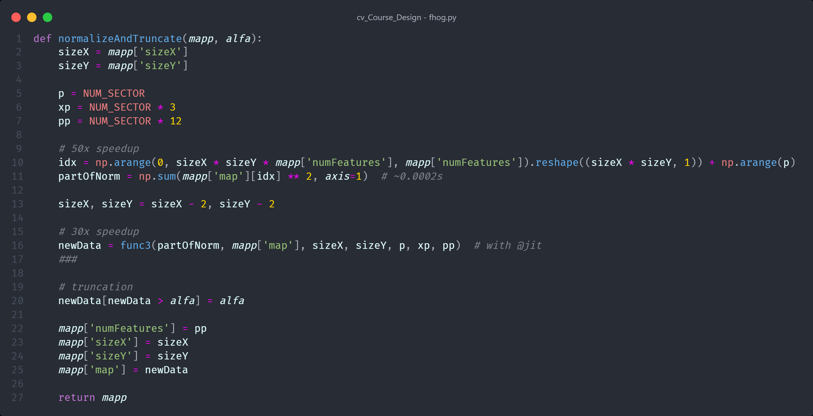

`normalizeAndTruncate`方法的主要逻辑是对方向梯度直方图(Histogram of Oriented Gradient，简称HOG)特征进行归一化和截断。

具体过程如下：
1. 对每个小区域计算梯度幅值的平方和，得到`partOfNorm`。
2. 对每个大区域(由4个小区域组成)，将每个小区域的HOG特征除以4个小区域的梯度幅值的平方和的平方根，进行L2归一化。每个大区域得到的新HOG特征存储在`newData`中。这里使用了一个未提供的函数`func3`，或者通过numpy的广播机制直接进行计算。
3. 对归一化后的HOG特征进行截断，即将大于`alfa`的值设置为`alfa`，以降低HOG特征的亮度对特征描述的影响。
4. 更新`mapp`字典，包括更新特征数量`numFeatures`，更新区域大小`sizeX`和`sizeY`，以及更新HOG特征`map`。

这个过程可以表示为以下的数学公式：

对于每个小区域i，计算梯度幅值的平方和，即`partOfNorm[i]`：

$$partOfNorm[i] = \sum_{j=0}^{p-1} map[i*p+j]^2$$

其中，p是每个区域的特征数量，j是特征的索引，map是原始的HOG特征。

对于每个大区域k，和每个特征j，计算归一化后的新HOG特征，即`newData[k*pp+j]`：

$$
newData[k*pp+j] \\ = \frac{map[i*p+j]}{\sqrt{partOfNorm[i]+partOfNorm[i+1]+OfNorm[i+sizeX+2]+partOfNorm[i+sizeX+2+1]}}
$$

其中，i是大区域k包含的一个小区域的索引，pp是新HOG特征的特征数量。

对于每个新HOG特征，进行截断，即：

$$newData[newData > \alpha] = \alpha$$

其中，$\alpha$是截断阈值。

#### 4.3.3 PCA特征(`fhog.PCAFeatureMaps`)

`PCAFeatureMaps`函数的目的是进行主成分分析(PCA)并获取新的特征图。

函数主要包含以下步骤：

1. 首先，函数定义了一些参数，包括原始特征图的特征数量`p`，新特征图的特征数量`pp`，和一些PCA转换的参数`yp`，`xp`，`nx`，`ny`。

2. 在循环中，对于每个区域，函数计算了新的特征值，这些特征值是原始特征图的一些特征值的加权和。加权系数是`ny`或`nx`，这两个参数是PCA转换的结果。

3. 最后，函数更新了特征图`mapp`，包括特征数量`numFeatures`和新的特征图`map`。

数学公式可以表示如下：

对于每个区域i，和新特征图的每个特征j，新的特征值`newData[i*pp+j]`是原始特征图的一些特征值的加权和：

$$
newData[i*pp+j] = \sum_{k=0}^{2*xp-1} map[i*p+idx1[k]] * ny
$$

$$
newData[i*pp+2*xp+j] = \sum_{k=0}^{xp-1} map[i*p+idx2[k]] * ny
$$

$$
newData[i*pp+3*xp+j] = \sum_{k=0}^{yp-1} map[i*p+idx3[k]] * nx
$$

其中，idx1, idx2, idx3是由PCA转换得到的索引数组。

## 五、实验

### 5.1 参数设计

以下是在KCFTracker类和fhog模块中涉及到的一些超参数和它们的位置：

1. **HOG参数**：在`fhog`模块中，HOG特征的参数主要在`fhog`函数中设定。其中`binSize`参数设定了每个单元的大小，`nOrients`设定了方向的数量。另外，在`get_features`函数中，通过`fhog`函数调用来提取HOG特征。

2. **ROI大小**：在`KCFTracker`类的`get_subwindow`函数中设定了ROI的大小，这是通过输入参数`pos`（目标中心的位置）和`sz`（目标的大小）来实现的。

3. **KCF参数**：在`KCFTracker`类的`_alphaf`和`_prob`属性中，保存了KCF的参数。其中，`_alphaf`保存了在频域中的训练模型，`_prob`保存了目标的先验概率。这些参数在`train`和`detect`函数中被更新和使用。

4. **PCA参数**：在`fhog`模块的`PCAFeatureMaps`函数中，PCA降维的相关参数主要通过`pp`参数设定。

5. **学习率参数**：在`KCFTracker`类的`interp_factor`属性中，设定了在线模型更新的学习率。在`train`函数中，通过`interp_factor`调整新的训练结果与旧的模型之间的权重。

以上就是各个超参数在代码中的位置。请注意，这些超参数通常需要根据实际的应用场景和数据集来进行调整。

### 5.2 性能优化

对于速度提升的部分，这是通过两种方式实现的：一种是使用numpy的广播机制代替循环，另一种是使用JIT编译器优化函数的性能。在注释的代码中，展示了这两种方式的性能提升效果。

具体详见**4.3 Numba加速的HOG特征提取。**

### 5.3 实验效果和界面展示

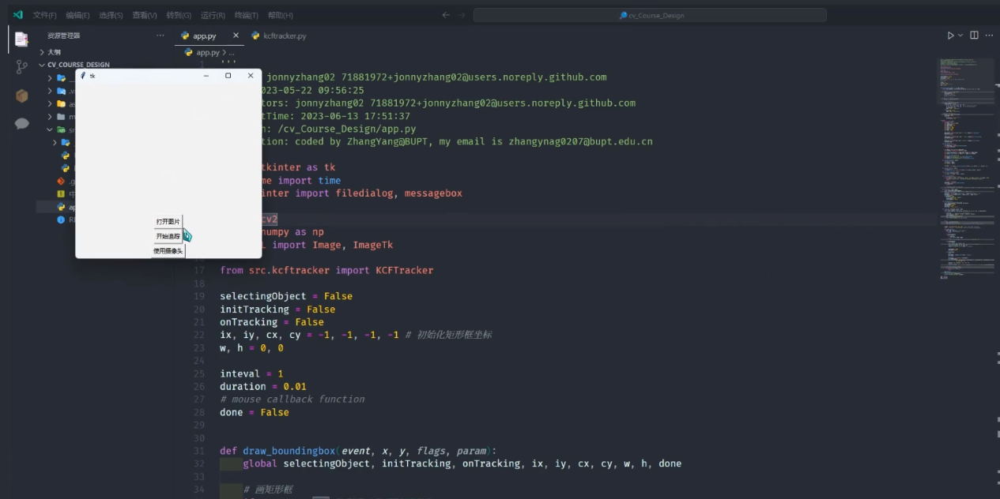


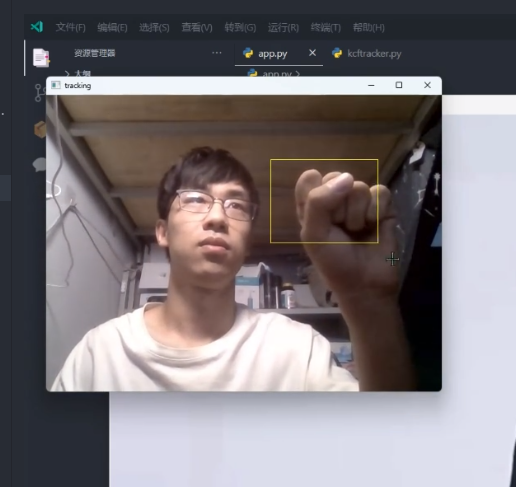


在[演示视频](./%E6%95%88%E6%9E%9C%E6%BC%94%E7%A4%BA.mp4)中有详细的展示


## 六、总结和启发

### 6.1 核心算法总结

总结KCFTracker类的运作流程如下：

1. **初始化**：首先，初始化KCFTracker，设定是否需要使用HOG特征，是否需要使用固定模板尺寸，以及是否需要进行多尺度估计。

2. **目标设定**：接下来，使用`init()`方法设置追踪目标的初始位置和尺寸。在这个方法中，首先会获取目标的ROI，并从该ROI中提取HOG特征。

3. **特征提取**：提取HOG特征是通过`fhog`模块完成的。fhog会首先计算梯度，然后将梯度投影到指定数量的方向扇区。然后，将HOG特征进行规范化和截断处理(`normalizeAndTruncate`)，以及使用PCA进行降维(`PCAFeatureMaps`)。这样就可以得到**HOG特征图**。

4. **模型训练**：在目标设定之后，会进行模型的训练。首先，对HOG特征图进行**傅立叶变换**，然后计算**核矩阵**(在频域中进行计算)，并获取训练的**滤波器模型**。对于KCF，**滤波器模型就是在频域中的核响应**。

5. **目标追踪**：在模型训练完成后，就可以进行目标追踪。在每一帧中，会获取新的ROI，并从中提取**HOG特征**。然后，利用模型进行检测，找出新的目标位置。这个过程是通过计算得分图并找到得分最高的位置完成的。最后，对模型进行更新，这一步是通过线性插值在旧模型和新检测到的模型之间进行更新。

即：

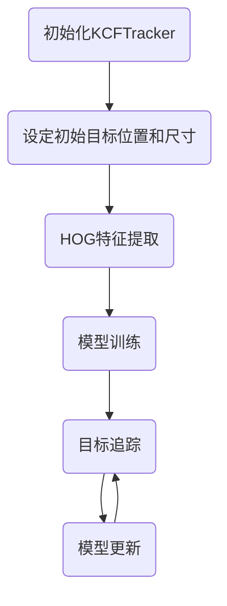
```mermaid
graph TB
    Init(初始化KCFTracker)
    InitTarget(设定初始目标位置和尺寸)
    HOGExtraction(HOG特征提取)
    ModelTraining(模型训练)
    ObjectTracking(目标追踪)
    ModelUpdate(模型更新)

    Init-->InitTarget
    InitTarget-->HOGExtraction
    HOGExtraction-->ModelTraining
    ModelTraining-->ObjectTracking
    ObjectTracking-->ModelUpdate
    ModelUpdate-->ObjectTracking
```

### 6.2 启发

从这次课程设计中，我们可以得到以下启示：

1. **特征选择的重要性**：**HOG特征**是`KCFTracker`成功的关键因素之一，因为它对目标对象的形状和外观具有良好的描述能力。这突出了在机器视觉任务中选择合适特征的重要性。

2. **优化的必要性**：在实现中，我们使用了大量的优化方法，如`jit`编译，使用**numpy向量化操作**等。这些优化对于实现实时跟踪是必要的。这也突出了在进行算法设计时，尽可能地考虑优化的重要性。

3. **代码模块化和可维护性**：通过将HOG特征提取、PCA处理等功能**模块化**，使得代码更加易于维护和理解。同时，通过封装为KCFTracker类，将相关的数据和方法组织在一起，也提高了代码的可读性和可用性。

4. **理论与实践的结合**：`KCFTracker`不仅包含理论模型(例如KCF理论)，也包含实践中的技巧(例如使用**PCA进行特征降维**，使用高**斯响应图**来更新ROI等)。这表明在解决实际问题时，需要理论和实践相结合。

5. **迭代更新和自适应的重要性**：`KCFTracker`通过在每个时间步更新模型来适应目标的变化，这是许多成功跟踪算法的共同特点，也是处理视频跟踪问题的关键。

6. **算法和模型的选择应根据具体应用和限制来定**：虽然KCFTracker在某些情况下表现得很好，但并不是所有情况都适用。比如，它在处理快速运动或者目标**严重遮挡的情况下可能就不够理想**(比如我们一开始想要跟踪篮球，但它总是被遮挡，一旦遮挡，跟踪效果就会变得很差)。所以，在实际应用中，我们需要根据具体的应用场景和限制(如运行时间，精度要求等)来选择和设计算法。

这些启示对于理解和设计视频跟踪算法，甚至更广泛的机器视觉和机器学习任务都是有帮助的。